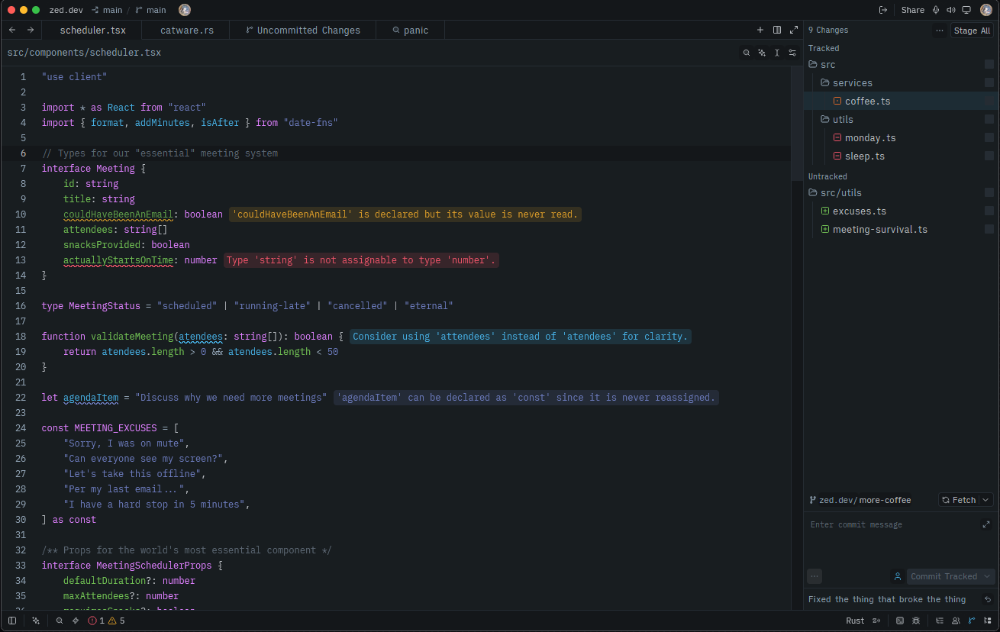

# zed-firefox-quantum-themes
A [Zed](https://zed.dev) port of the Firefox Quantum themes for Visual Studio Code, based on Firefox DevTools colors

## Preview

## Installation
Currently only Dev Extension installation is supported. To install the theme, follow these steps:
1. Clone the repo somewhere on your computer.
2. Open Zed and go to `Extensions` (Ctrl-Shift-X) > `Install Dev Extension` on the upper right corner
3. Alternatively open the Command Palette (Ctrl-Shift-P) and type "Extensions: Install dev extension".
4. Select the folder where you cloned the repo and click `Select`.
5. Select the newly installed theme.
